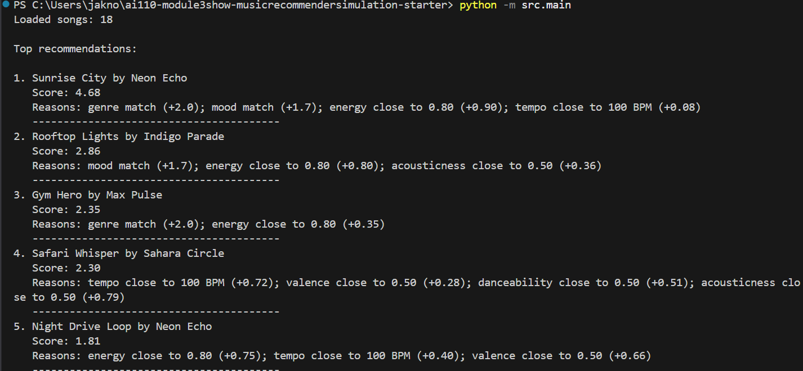
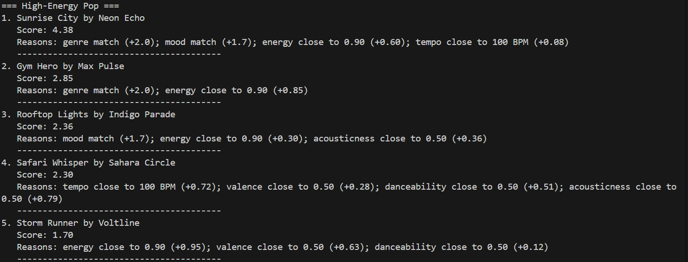
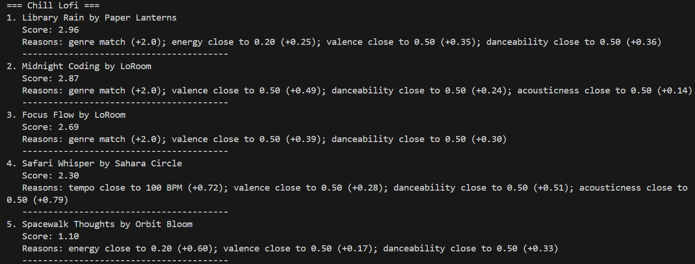
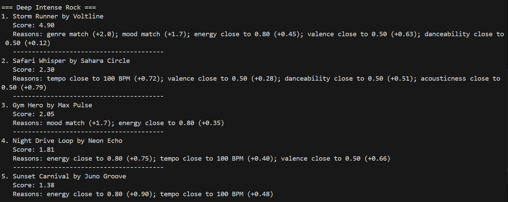

# 🎵 Music Recommender Simulation

## Project Summary

In this project you will build and explain a small music recommender system.

Your goal is to:

- Represent songs and a user "taste profile" as data
- Design a scoring rule that turns that data into recommendations
- Evaluate what your system gets right and wrong
- Reflect on how this mirrors real world AI recommenders

Replace this paragraph with your own summary of what your version does.






---

## How The System Works

In the real world, recommendation systems combine user preferences, item attributes, and patterns from listener behavior to suggest what a person will enjoy next. For this simulation, the plan is to build a simple content-based recommender that uses a small song catalog and a user taste profile to find the closest matches.

The process is:

1. Read the song catalog from `data/songs.csv`.
2. Define a user taste profile with preferred genre, mood, and target values for audio features.
3. Loop over every song and compute a score based on how closely the song matches the user's profile.
4. Rank songs by their score.
5. Output the top K recommendations.

Song features:

- `genre`
- `mood`
- `energy`
- `tempo_bpm`
- `valence`
- `danceability`
- `acousticness`

UserProfile features:

- preferred `genre`
- preferred `mood`
- preferred `energy`
- preferred `tempo_bpm`
- preferred `valence`
- preferred `danceability`
- preferred `acousticness`

This system prioritizes a clear content-based match. Genre and mood are used as strong categorical signals, while energy, tempo, valence, danceability, and acousticness are used to fine-tune similarity so the final ranking surfaces mellow, chill tracks that feel like the user’s preferred vibe.

### Algorithm Recipe

1. Load songs from `data/songs.csv`.
2. Define a user profile with preferred genre, mood, and target values for the numerical audio features.
3. For each song:
   - award points for matching genre and mood
   - calculate distance from the user’s target energy, tempo, valence, danceability, and acousticness
   - combine categorical matches and numeric proximity into a single score
4. Sort songs by descending score.
5. Return the top K songs as recommendations.

### Expected biases

- The model will favor genres and moods explicitly listed in the user profile, so it can be biased toward the user's declared favorite styles.
- Songs with missing or weak metadata are disadvantaged because this approach relies heavily on song attributes.
- The system may also under-recommend diverse or unexpected music, since it prefers songs that are very similar to the user’s profile.

---

## Getting Started

### Setup

1. Create a virtual environment (optional but recommended):

   ```bash
   python -m venv .venv
   source .venv/bin/activate      # Mac or Linux
   .venv\Scripts\activate         # Windows

2. Install dependencies

```bash
pip install -r requirements.txt
```

3. Run the app:

```bash
python -m src.main
```

### Running Tests

Run the starter tests with:

```bash
pytest
```

You can add more tests in `tests/test_recommender.py`.

---

## Experiments You Tried

Use this section to document the experiments you ran. For example:

- What happened when you changed the weight on genre from 2.0 to 0.5
- What happened when you added tempo or valence to the score
- How did your system behave for different types of users

---

## Limitations and Risks

Summarize some limitations of your recommender.

Examples:

- It only works on a tiny catalog
- It does not understand lyrics or language
- It might over favor one genre or mood

You will go deeper on this in your model card.

---

## Reflection

Read and complete `model_card.md`:

[**Model Card**](model_card.md)

Write 1 to 2 paragraphs here about what you learned:

- about how recommenders turn data into predictions
- about where bias or unfairness could show up in systems like this


---

## 7. `model_card_template.md`

Combines reflection and model card framing from the Module 3 guidance. :contentReference[oaicite:2]{index=2}  

```markdown
# 🎧 Model Card - Music Recommender Simulation

## 1. Model Name

Give your recommender a name, for example:

> VibeFinder 1.0

---

## 2. Intended Use

- What is this system trying to do
- Who is it for

Example:

> This model suggests 3 to 5 songs from a small catalog based on a user's preferred genre, mood, and energy level. It is for classroom exploration only, not for real users.

---

## 3. How It Works (Short Explanation)

Describe your scoring logic in plain language.

- What features of each song does it consider
- What information about the user does it use
- How does it turn those into a number

Try to avoid code in this section, treat it like an explanation to a non programmer.

---

## 4. Data

Describe your dataset.

- How many songs are in `data/songs.csv`
- Did you add or remove any songs
- What kinds of genres or moods are represented
- Whose taste does this data mostly reflect

---

## 5. Strengths

Where does your recommender work well

You can think about:
- Situations where the top results "felt right"
- Particular user profiles it served well
- Simplicity or transparency benefits

---

## 6. Limitations and Bias

Where does your recommender struggle

Some prompts:
- Does it ignore some genres or moods
- Does it treat all users as if they have the same taste shape
- Is it biased toward high energy or one genre by default
- How could this be unfair if used in a real product

---

## 7. Evaluation

How did you check your system

Examples:
- You tried multiple user profiles and wrote down whether the results matched your expectations
- You compared your simulation to what a real app like Spotify or YouTube tends to recommend
- You wrote tests for your scoring logic

You do not need a numeric metric, but if you used one, explain what it measures.

---

## 8. Future Work

If you had more time, how would you improve this recommender

Examples:

- Add support for multiple users and "group vibe" recommendations
- Balance diversity of songs instead of always picking the closest match
- Use more features, like tempo ranges or lyric themes

---

## 9. Personal Reflection

A few sentences about what you learned:

- What surprised you about how your system behaved
- How did building this change how you think about real music recommenders
- Where do you think human judgment still matters, even if the model seems "smart"

