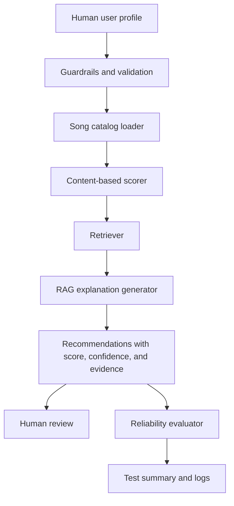

# Music Recommender RAG System

## Original Project

This project builds on my Modules 1-3 project, **AI110 Module 3 Show: Music Recommender Simulation Starter**. The original version loaded a small CSV song catalog, compared songs to a user taste profile, scored each song with content-based rules, and printed ranked recommendations. Its goal was to demonstrate how simple AI-style recommender logic can turn structured song metadata into personalized results.

## Title and Summary

**Music Recommender RAG System** is a command-line AI music recommendation app. A user profile is converted into a retrieval query, the system searches the catalog for relevant songs, and the recommender generates grounded explanations using retrieved catalog evidence.

This matters because recommendation systems should be explainable, testable, and safe to run. Instead of only saying "here are songs," this project shows why songs were recommended, how confident the system is, and whether reliability checks passed.

## Advanced AI Feature

The advanced feature is **Retrieval-Augmented Generation (RAG)** integrated into the main recommendation workflow.

The system does not use retrieval as a separate script. Every recommendation created by `Recommender.recommend_with_context()` retrieves similar catalog songs, calculates a confidence score, and generates an explanation grounded in that retrieved evidence. The retrieved songs affect what the app prints as the final AI explanation.

## Architecture Overview



Data flow:

1. A human supplies or selects a profile such as genre, mood, target energy, and acoustic preference.
2. The app validates the input and loads `data/songs.csv`.
3. The scorer ranks songs using genre, mood, energy, tempo, valence, danceability, and acousticness.
4. The retriever finds catalog songs that support each recommendation as evidence.
5. The explanation generator creates a grounded recommendation explanation.
6. The evaluator checks whether representative profiles return expected genres, moods, confidence levels, and retrieved context.

## Setup Instructions

1. Clone or open this repository.

2. Create a virtual environment:

   ```bash
   python3 -m venv .venv
   source .venv/bin/activate
   ```

3. Install dependencies:

   ```bash
   python -m pip install -r requirements.txt
   ```

4. Run the app:

   ```bash
   python -m src.main
   ```

5. Run tests:

   ```bash
   pytest -q
   ```

The app writes runtime logs to `recommender.log`.

## Sample Interactions

### Example 1: High-Energy Pop

Input profile:

```python
UserProfile("pop", "happy", 0.9, likes_acoustic=False)
```

Output excerpt:

```text
1. Sunrise City by Neon Echo
   Score: 4.81
   Confidence: 62%
   Retrieved evidence: Gym Hero, Rooftop Lights, Bassline Bounce
   AI explanation: Sunrise City by Neon Echo scored 4.81 with 62% confidence because genre match, mood match, energy close to 0.90, and acousticness close to 0.20.
```

### Example 2: Chill Lofi

Input profile:

```python
UserProfile("lofi", "chill", 0.25, likes_acoustic=True)
```

Output excerpt:

```text
1. Library Rain by Paper Lanterns
   Score: 5.09
   Confidence: 66%
   Retrieved evidence: Midnight Coding, Spacewalk Thoughts, Focus Flow
   AI explanation: Library Rain scored highly because it matches lofi/chill preferences and is close to the requested low-energy acoustic sound.
```

### Example 3: Deep Intense Rock

Input profile:

```python
UserProfile("rock", "intense", 0.85, likes_acoustic=False)
```

Output excerpt:

```text
1. Storm Runner by Voltline
   Score: 5.39
   Confidence: 70%
   Retrieved evidence: Gym Hero, Bassline Bounce, Sunset Carnival
   AI explanation: Storm Runner scored highly because it matches rock/intense preferences and has energy close to the target.
```

## Design Decisions

I kept the original content-based recommender because it is transparent and easy to test. The RAG addition improves the system by retrieving nearby catalog examples and using them as evidence for explanations.

The main trade-off is that this is not a large language model or production recommender. It uses a small catalog and template-based explanations, which makes it less flexible but easier to audit. For a classroom or portfolio project, that transparency is a strength because each recommendation can be traced back to scores and retrieved evidence.

## Reliability and Evaluation

The project includes automated tests in `tests/test_recommender.py` and an integrated evaluator in `src/evaluator.py`.

Current app evaluation:

```text
3 out of 3 evaluation cases passed; average top-result confidence was 66%.
```

The reliability checks verify:

- the top song matches the expected genre
- the top song matches the expected mood
- the confidence score is above the threshold
- the recommendation includes retrieved catalog evidence
- invalid inputs, such as `k=0`, raise safe errors
- out-of-range numeric preferences are clamped

What worked: the system reliably found strong matches for high-energy pop, chill lofi, and intense rock profiles. What did not work perfectly: confidence scores are only estimates based on scoring rules, not true probabilities. I learned that even simple AI systems need tests because a recommendation can look reasonable while still failing a specific requirement.

## Limitations, Bias, and Ethics

The system is limited by its small catalog of 18 songs. It can over-favor exact genre and mood labels, which may reduce discovery and under-recommend related styles. It also does not use listening history, lyrics, artist background, popularity, or user feedback.

The system could be misused if someone treated it like a complete personalization engine. To reduce that risk, the app logs what it does, exposes confidence scores, explains recommendations, and keeps the dataset small and inspectable.

What surprised me while testing reliability was how much the final ranking depended on weights and labels. A song could have the right energy but lose to another song because of exact mood matching. That showed me why real AI systems need both automated checks and human review.

## Collaboration With AI

AI was helpful when suggesting that the project should use RAG because retrieval fits naturally with a catalog-based recommender. That suggestion improved the project because explanations became grounded in real song metadata instead of generic text.

One flawed AI suggestion was to treat the original placeholder `Recommender.recommend()` method as if it already implemented meaningful ranking. After checking the code manually, I found that it only returned the first `k` songs. I corrected that by implementing scoring, retrieval, confidence, and tests.

## Reflection

This project taught me that AI problem-solving is not only about generating an answer. A useful system needs data flow, guardrails, logging, tests, and a way for humans to understand why the output was produced.

It also changed how I think about recommenders. Even a small recommender can feel intelligent when it combines structured metadata with clear ranking rules, but the system still reflects the assumptions and limitations of its data and scoring design.
